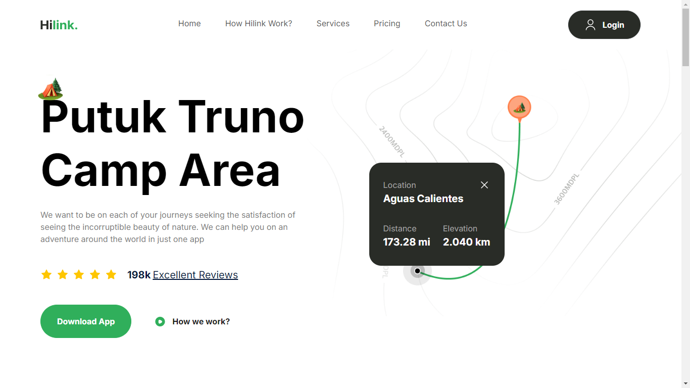

# Travel App

Esta é uma landing page projetada para promover experiências de viagem, construída utilizando **Next.js**, **Tailwind CSS** e **TypeScript**. A página oferece uma interface atraente onde os usuários podem explorar diferentes destinos, descobrir promoções especiais e se inspirar para suas próximas aventuras de viagem.

## Tecnologias Utilizadas

- [Next.js](https://nextjs.org/) - Framework React para desenvolvimento de aplicações web rápidas e escaláveis.
- [Tailwind CSS](https://tailwindcss.com/) - Um framework CSS utilitário para estilização de interfaces.
- [TypeScript](https://www.typescriptlang.org/) - Um superconjunto de JavaScript que adiciona tipagem estática.

## Demonstração da Aplicação



## Instalação

Para rodar a aplicação localmente, siga os passos abaixo:

1. Clone o repositório:
   ```bash
   git clone https://github.com/seu-usuario/travel-app.git
   cd travel-app
   ```

2. Instale as dependências:
   ```bash
   npm install
   ```

3. Inicie o servidor de desenvolvimento:
   ```bash
   npm run dev
   ```

4. Acesse a aplicação no seu navegador:
   ```
   http://localhost:3000
   ```

## Estrutura do Projeto

```plaintext
travel-app/
├── public/
│   └── screenshots/
│       └── travel-app.png
├── src/
│   ├── app/
│   ├── components/
│   └── constants/
├── package.json
├── tailwind.config.ts
└── tsconfig.json
```

## Contribuição

Se você desejar contribuir para este projeto, sinta-se à vontade para abrir uma issue ou enviar um pull request.

## Licença

Este projeto está licenciado sob a MIT License. Veja o arquivo [LICENSE](LICENSE) para mais detalhes.
